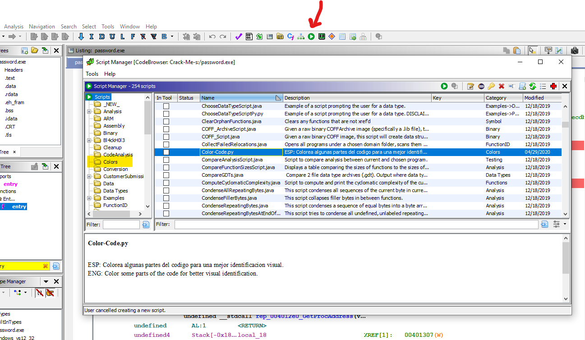
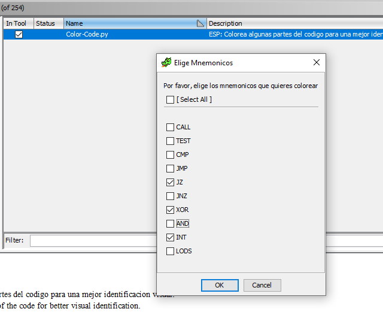
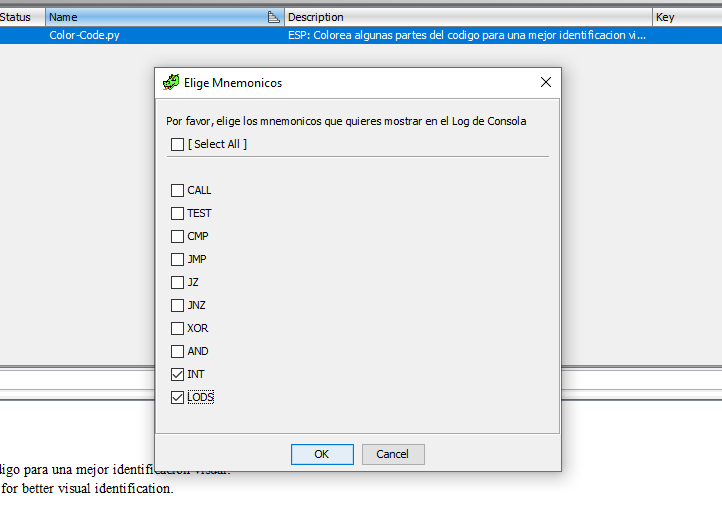
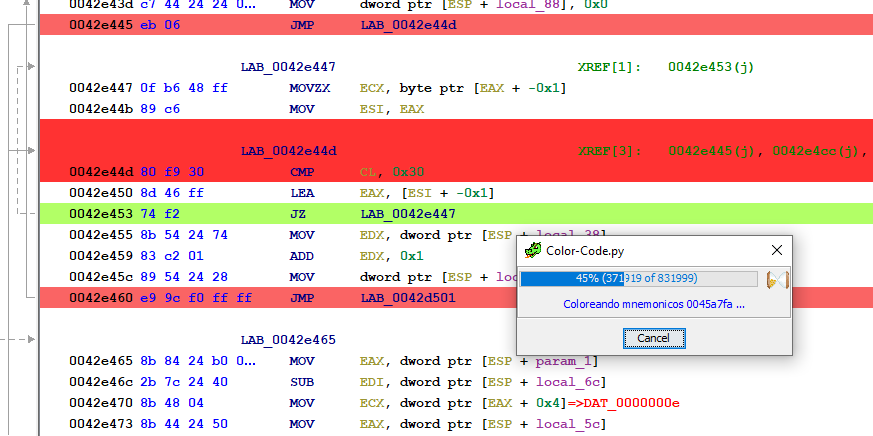
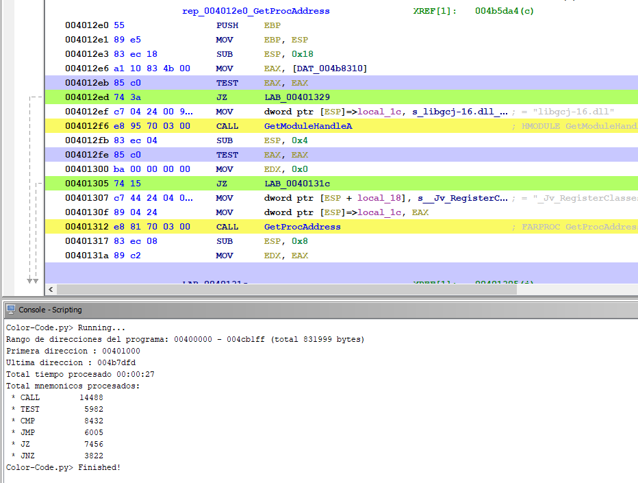
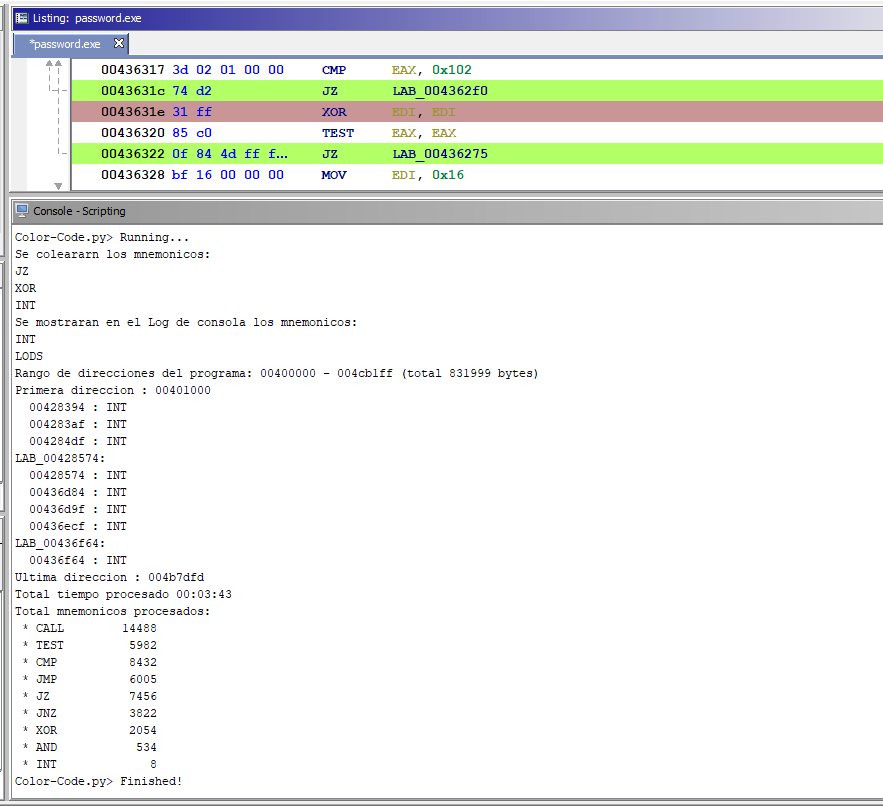
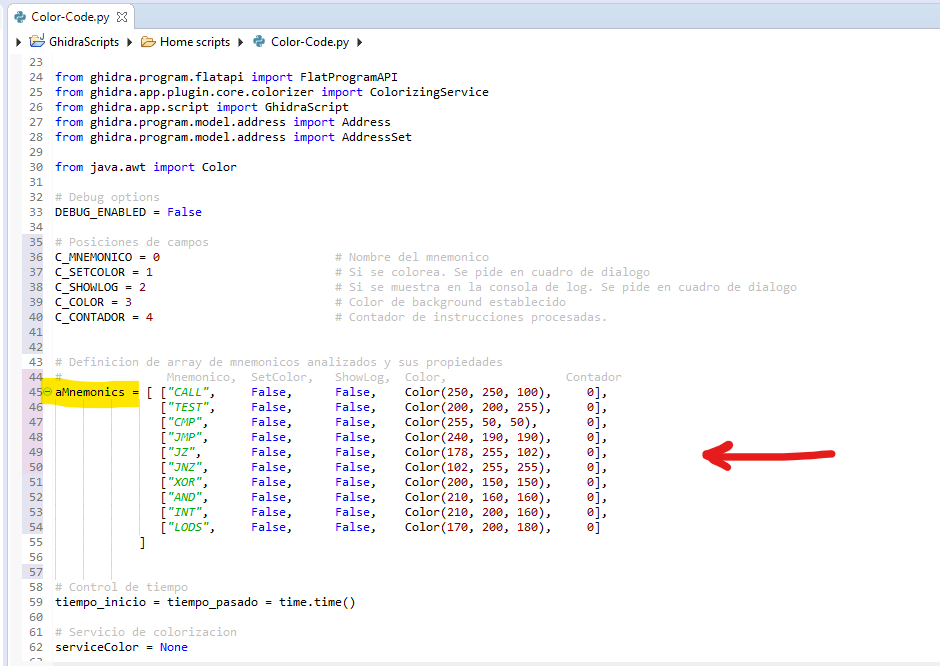

# Color-Code

## Instalación

Copia el script **Color-Code.py** en el directorio de scripts de Ghidra. Normalmente **$USER_HOME/ghidra_scripts**

Tras reiniciar **Ghidra** al cargar el **"Script Manager"** en la ventana denetro de la sección **Colors** encontrarás este script.

 

## Uso

Tras ejecutar el script, aparecerá un cuadro de diálogo que pedirá que mnemonicos se quieren colorear.

 

Después pedirá que mnemónicos se quieren mostrar en el log de consola.

 

Seguidamente se mostrará un cuadro de diálogo con el progreso del proceso.

 

Al finalizar muestra una estadistica del tiempo de procesado y los mnemonicos que ha tratado y coloreado.

En el listado del codigo veremos estos mnemonicos coloreados.

 

Ejemplo de resultado con cambios efectuados en **v0.2**

 

## Customización del código

El script tiene al principio un array multidimensional que se puede completar a gusto de cada usuario. Añadiendo o quitando mnemonicos y definiendo el color que se desea.

 

## Descarga

[**Color-Code.py**](Color-Code.py)

## Historial de versiones

**v0.1**    29/04/2020  Lista mnemonicos a procesar fija en array

**v0.2**    01/05/2020  Se permite seleccionar que mnemonicos se colorean y muestran en log mediante cuadro de dialogo.
                        Opcion en barra de menu de Ghidra